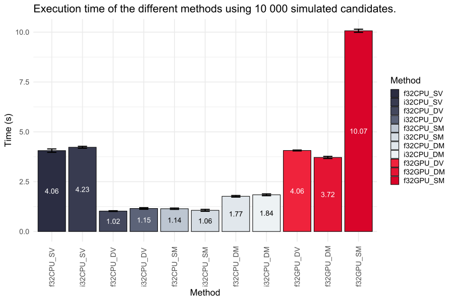
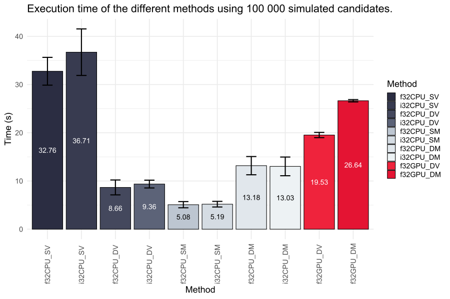
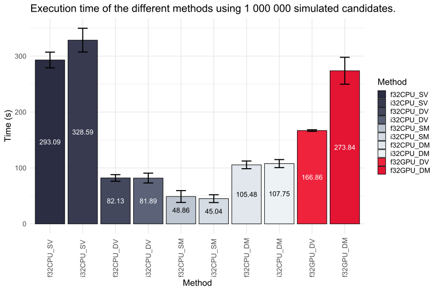
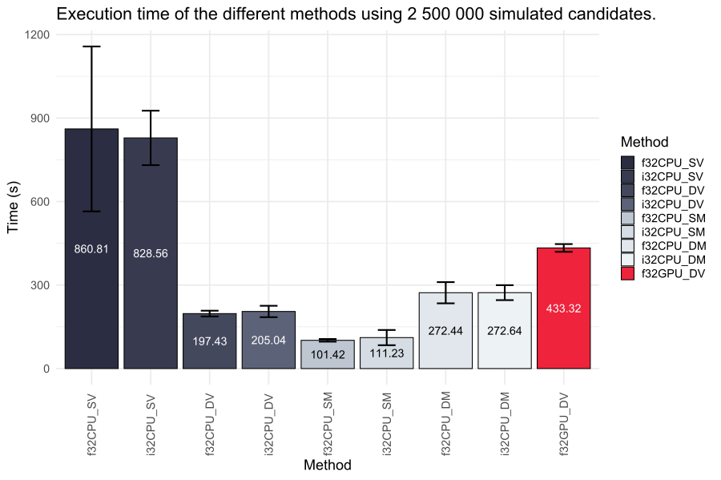
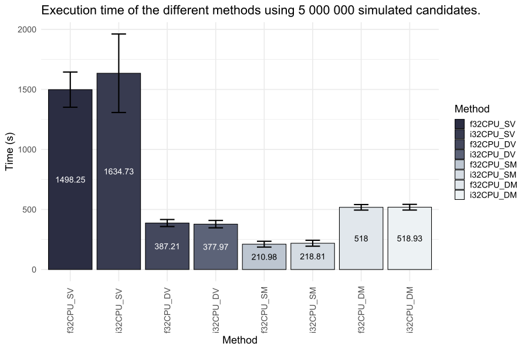
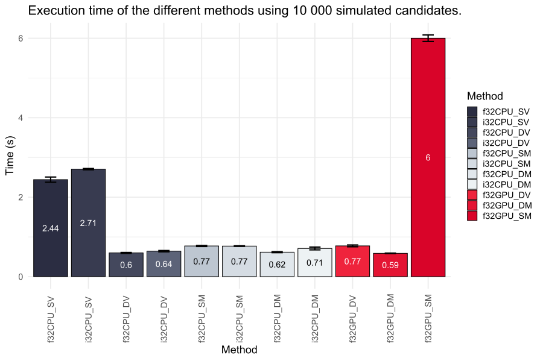
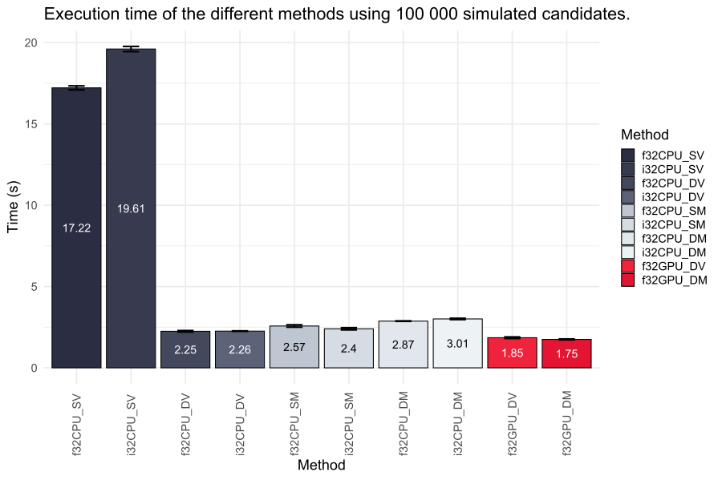
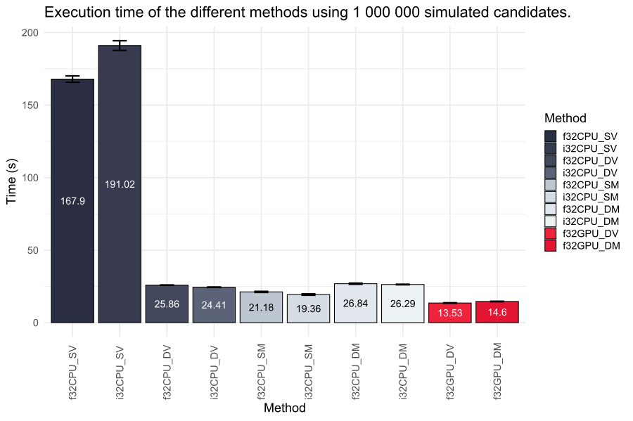
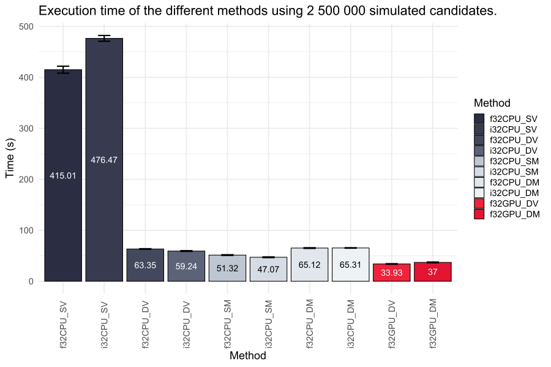

# Benchmarks

The following are basically benchmarks of the different sparse matrix/vector
multiplication methods of [Eigen](https://eigen.tuxfamily.org/) and
[cuSPARSE](https://docs.nvidia.com/cuda/cusparse/).

These benchmarks are supposed to be worst-case scenarios when doing candidate
search, e.g. these benchmarks assume that every peptide would yield 100 ions and
every spectrum 1000 peaks, while also performing normalization and gaussian peak
modeling.

We ran benchmarks for different database sizes (different number of candidate
peptides to be considered) to assess how that influences performance of the
different methods. Furthermore, every benchmark is run five times to get a more
comprehensive overview of computation times. The averages are plotted below,
with error bars denoting standard deviation.

For all benchmarks we search 1001 spectra (this is specifically selected to see
if batched multiplication has influence on performance) and return the top 100
candidates. All benchmarks were conducted during light background usage (e.g.
open browser, text editor, etc.).

## Abbreviations

The following terms are used synonymously throughout the document:
- `f32CPU_SV`: Float32-(CPU-)based sparse matrix * sparse vector search (using [Eigen](https://eigen.tuxfamily.org/))
- `i32CPU_SV`: Int32-(CPU-)based sparse matrix * sparse vector search (using [Eigen](https://eigen.tuxfamily.org/))
- `f32CPU_DV`: Float32-(CPU-)based sparse matrix * dense vector search (using [Eigen](https://eigen.tuxfamily.org/))
- `i32CPU_DV`: Int32-(CPU-)based sparse matrix * dense vector search (using [Eigen](https://eigen.tuxfamily.org/))
- `f32CPU_SM`: Float32-(CPU-)based sparse matrix * sparse matrix search (using [Eigen](https://eigen.tuxfamily.org/))
- `i32CPU_SM`: Int32-(CPU-)based sparse matrix * sparse matrix search (using [Eigen](https://eigen.tuxfamily.org/))
- `f32CPU_DM`: Float32-(CPU-)based sparse matrix * dense matrix search (using [Eigen](https://eigen.tuxfamily.org/))
- `i32CPU_DM`: Int32-(CPU-)based sparse matrix * dense matrix search (using [Eigen](https://eigen.tuxfamily.org/))
- `f32GPU_DV`: Float32-(GPU-)based sparse matrix * dense vector search (using [cuSPARSE](https://docs.nvidia.com/cuda/cusparse/))
- `f32GPU_DM`: Float32-(GPU-)based sparse matrix * dense matrix search (using [cuSPARSE](https://docs.nvidia.com/cuda/cusparse/))
- `f32GPU_SM`: Float32-(GPU-)based sparse matrix * sparse matrix search (using [cuSPARSE](https://docs.nvidia.com/cuda/cusparse/))

## System 1 - Standard Office PC

The first system we tested this on was a standard office laptop with the
following hardware:
- Model: Dell Precision 3560
- CPU: Intel Core i7-1185G7 [4 cores @ 1.8 GHz base / 3.0 GHz boost]
- RAM: 16 GB DDR4 RAM [3200 MT/s, NA CAS]
- GPU: Nvidia T500 [2 GB VRAM]
- SSD/HDD: 512 GB NVMe SSD
- OS: Windows 10 Education 64-bit (10.0, Build 19045)

### 10 000 Candidates

`A * B = C where A[10000, 500000] and B[500000, 1001]`

Using a database of 10 000 peptide candidates the methods yield the following
runtimes:

**Figure 1:** Float32-based sparse matrix * dense vector search using
[Eigen](https://eigen.tuxfamily.org/) yields the fastest computation time of
only 1.02 seconds.

Expand for raw data!

| Method    |   Candidates |   Run 1 |     Run 2 |    Run 3 |    Run 4 |    Run 5 |      Min |      Max |     Mean |        SD |   Rank |    Y |   N |
|:----------|-------------:|--------:|----------:|---------:|---------:|---------:|---------:|---------:|---------:|----------:|-------:|-----:|----:|
| f32CPU_SV |        10000 | 3.96232 |  3.99317  |  4.16333 |  4.12433 |  4.03925 | 3.96232  |  4.16333 |  4.05648 | 0.0854273 |      8 | 1001 | 100 |
| i32CPU_SV |        10000 | 4.20677 |  4.21627  |  4.18454 |  4.21334 |  4.30658 | 4.18454  |  4.30658 |  4.2255  | 0.0469989 |      9 | 1001 | 100 |
| f32CPU_DV |        10000 | 1.02714 |  0.999038 |  1.04962 |  1.01544 |  1.03139 | 0.999038 |  1.04962 |  1.02453 | 0.0188148 |      1 | 1001 | 100 |
| i32CPU_DV |        10000 | 1.088   |  1.17937  |  1.17109 |  1.1531  |  1.18244 | 1.088    |  1.18244 |  1.1548  | 0.0390465 |      4 | 1001 | 100 |
| f32CPU_SM |        10000 | 1.16123 |  1.14092  |  1.08636 |  1.17035 |  1.1552  | 1.08636  |  1.17035 |  1.14281 | 0.0333204 |      3 | 1001 | 100 |
| i32CPU_SM |        10000 | 1.01817 |  1.06418  |  1.01925 |  1.07144 |  1.13448 | 1.01817  |  1.13448 |  1.0615  | 0.0476856 |      2 | 1001 | 100 |
| f32CPU_DM |        10000 | 1.8242  |  1.77216  |  1.74569 |  1.715   |  1.77249 | 1.715    |  1.8242  |  1.76591 | 0.040254  |      5 | 1001 | 100 |
| i32CPU_DM |        10000 | 1.91169 |  1.86213  |  1.79263 |  1.82148 |  1.81984 | 1.79263  |  1.91169 |  1.84156 | 0.0463954 |      6 | 1001 | 100 |
| f32GPU_DV |        10000 | 4.03647 |  4.09389  |  4.05512 |  4.07632 |  4.05695 | 4.03647  |  4.09389 |  4.06375 | 0.0219723 |      9 | 1001 | 100 |
| f32GPU_DM |        10000 | 3.62518 |  3.74288  |  3.75778 |  3.71924 |  3.73217 | 3.62518  |  3.75778 |  3.71545 | 0.0524091 |      7 | 1001 | 100 |
| f32GPU_SM |        10000 | 9.95502 | 10.0398   | 10.1103  | 10.1644  | 10.0673  | 9.95502  | 10.1644  | 10.0674  | 0.0784879 |     11 | 1001 | 100 |

### 100 000 Candidates

`A * B = C where A[100000, 500000] and B[500000, 1001]`

Using a database of 100 000 peptide candidates the methods yield the following
runtimes:

**Figure 2:** Float32-based sparse matrix * sparse matrix search using
[Eigen](https://eigen.tuxfamily.org/) yields the fastest computation time of
only 5.08 seconds. Note that `f32GPU_SM` has been excluded from the plot since
computation times exceeded all other methods by more than 10-fold. The raw data
is available below.

Expand for raw data!

| Method    |   Candidates |     Run 1 |     Run 2 |     Run 3 |     Run 4 |     Run 5 |       Min |       Max |      Mean |        SD |   Rank |    Y |   N |
|:----------|-------------:|----------:|----------:|----------:|----------:|----------:|----------:|----------:|----------:|----------:|-------:|-----:|----:|
| f32CPU_SV |       100000 |  35.304   |  34.8771  |  31.7219  |  33.6381  |  28.2473  |  28.2473  |  35.304   |  32.7577  |  2.87956  |      9 | 1001 | 100 |
| i32CPU_SV |       100000 |  41.3168  |  42.1746  |  35.1852  |  33.7421  |  31.1516  |  31.1516  |  42.1746  |  36.7141  |  4.82477  |     10 | 1001 | 100 |
| f32CPU_DV |       100000 |   9.8869  |   9.8668  |   9.57659 |   7.34046 |   6.65369 |   6.65369 |   9.8869  |   8.66489 |  1.54662  |      3 | 1001 | 100 |
| i32CPU_DV |       100000 |   9.78072 |   9.80233 |   9.30471 |   7.98685 |   9.94904 |   7.98685 |   9.94904 |   9.36473 |  0.807484 |      4 | 1001 | 100 |
| f32CPU_SM |       100000 |   5.92302 |   5.56398 |   4.88576 |   4.40602 |   4.63187 |   4.40602 |   5.92302 |   5.08213 |  0.639863 |      1 | 1001 | 100 |
| i32CPU_SM |       100000 |   5.36173 |   5.56918 |   5.83226 |   4.43903 |   4.73719 |   4.43903 |   5.83226 |   5.18788 |  0.581964 |      2 | 1001 | 100 |
| f32CPU_DM |       100000 |  13.9166  |  14.7445  |  14.933   |  11.0524  |  11.2453  |  11.0524  |  14.933   |  13.1783  |  1.89294  |      6 | 1001 | 100 |
| i32CPU_DM |       100000 |  14.0893  |  14.2498  |  14.913   |  11.2577  |  10.6276  |  10.6276  |  14.913   |  13.0275  |  1.9409   |      5 | 1001 | 100 |
| f32GPU_DV |       100000 |  19.6112  |  20.1476  |  19.9083  |  19.1877  |  18.8013  |  18.8013  |  20.1476  |  19.5312  |  0.542965 |      7 | 1001 | 100 |
| f32GPU_DM |       100000 |  26.7439  |  26.9163  |  26.7714  |  26.4168  |  26.3571  |  26.3571  |  26.9163  |  26.6411  |  0.241999 |      8 | 1001 | 100 |
| f32GPU_SM |       100000 | 880.093   | 919.047   | 807.312   | 792.249   | 774.371   | 774.371   | 919.047   | 834.615   | 61.9812   |     11 | 1001 | 100 |

### 1 000 000 Candidates

`A * B = C where A[1000000, 500000] and B[500000, 1001]`

Using a database of 1 000 000 peptide candidates the methods yield the following
runtimes:

**Figure 3:** Int32-based sparse matrix * sparse matrix search using
[Eigen](https://eigen.tuxfamily.org/) yields the fastest computation time of
only 45.04 seconds. Note that `f32GPU_SM` has been excluded from the plot since
the method ran out of memory. The raw data is available below.

Expand for raw data!

| Method    |   Candidates |    Run 1 |    Run 2 |    Run 3 |    Run 4 |    Run 5 |      Min |      Max |     Mean |       SD |   Rank |    Y |   N |
|:----------|-------------:|---------:|---------:|---------:|---------:|---------:|---------:|---------:|---------:|---------:|-------:|-----:|----:|
| f32CPU_SV |      1000000 | 292.024  | 305.725  | 275.855  | 283.298  | 308.572  | 275.855  | 308.572  | 293.095  | 14.0837  |      9 | 1001 | 100 |
| i32CPU_SV |      1000000 | 337.896  | 330.922  | 293.953  | 328.767  | 351.387  | 293.953  | 351.387  | 328.585  | 21.2805  |     10 | 1001 | 100 |
| f32CPU_DV |      1000000 |  87.1387 |  78.9427 |  73.9562 |  82.5062 |  88.0868 |  73.9562 |  88.0868 |  82.1261 |  5.8669  |      4 | 1001 | 100 |
| i32CPU_DV |      1000000 |  88.2644 |  76.9449 |  70.4682 |  81.2829 |  92.4659 |  70.4682 |  92.4659 |  81.8853 |  8.77158 |      3 | 1001 | 100 |
| f32CPU_SM |      1000000 |  59.1796 |  42.2678 |  38.3327 |  43.238  |  61.2774 |  38.3327 |  61.2774 |  48.8591 | 10.5662  |      2 | 1001 | 100 |
| i32CPU_SM |      1000000 |  41.7158 |  45.5913 |  38.0705 |  43.2118 |  56.596  |  38.0705 |  56.596  |  45.0371 |  7.0145  |      1 | 1001 | 100 |
| f32CPU_DM |      1000000 | 105.11   | 106.617  |  95.4387 | 105.418  | 114.833  |  95.4387 | 114.833  | 105.483  |  6.88718 |      5 | 1001 | 100 |
| i32CPU_DM |      1000000 | 113.402  | 105.918  |  96.2186 | 109.205  | 113.995  |  96.2186 | 113.995  | 107.748  |  7.23534 |      6 | 1001 | 100 |
| f32GPU_DV |      1000000 | 166.4    | 165.727  | 165.672  | 167.374  | 169.121  | 165.672  | 169.121  | 166.859  |  1.4387  |      7 | 1001 | 100 |
| f32GPU_DM |      1000000 | 301.266  | 299.136  | 254.768  | 257.244  | 256.796  | 254.768  | 301.266  | 273.842  | 24.0922  |      8 | 1001 | 100 |

### 2 500 000 Candidates

`A * B = C where A[2500000, 500000] and B[500000, 1001]`

Using a database of 2 500 000 peptide candidates the methods yield the following
runtimes:

**Figure 4:** Float32-based sparse matrix * sparse matrix search using
[Eigen](https://eigen.tuxfamily.org/) yields the fastest computation time of
only 101.42 seconds. Note that `f32GPU_DM` has been excluded from the plot since
the computation time exceeded that of other methods by more than 10-fold and
`f32GPU_SM` has been excluded from the plot since the method ran out of memory.
The raw data is available below.

Expand for raw data!

| Method    |   Candidates |    Run 1 |    Run 2 |     Run 3 |     Run 4 |    Run 5 |       Min |      Max |     Mean |        SD |   Rank |    Y |   N |
|:----------|-------------:|---------:|---------:|----------:|----------:|---------:|----------:|---------:|---------:|----------:|-------:|-----:|----:|
| f32CPU_SV |      2500000 |  692.117 |  829.181 |  695.621  |  706.285  | 1380.83  |  692.117  | 1380.83  |  860.808 | 296.247   |      9 | 1001 | 100 |
| i32CPU_SV |      2500000 |  800.103 |  811.7   |  764.923  |  766.638  |  999.444 |  764.923  |  999.444 |  828.561 |  97.6981  |      8 | 1001 | 100 |
| f32CPU_DV |      2500000 |  204.586 |  207.268 |  187.071  |  185.345  |  202.865 |  185.345  |  207.268 |  197.427 |  10.3792  |      3 | 1001 | 100 |
| i32CPU_DV |      2500000 |  190.583 |  220.49  |  185.285  |  196.224  |  232.609 |  185.285  |  232.609 |  205.038 |  20.4678  |      4 | 1001 | 100 |
| f32CPU_SM |      2500000 |  104.16  |  103.163 |   96.9828 |   96.1288 |  106.669 |   96.1288 |  106.669 |  101.421 |   4.63096 |      1 | 1001 | 100 |
| i32CPU_SM |      2500000 |  106.88  |  159.144 |   93.4166 |   95.3154 |  101.387 |   93.4166 |  159.144 |  111.229 |  27.3045  |      2 | 1001 | 100 |
| f32CPU_DM |      2500000 |  278.991 |  334.042 |  240.312  |  242.37   |  266.467 |  240.312  |  334.042 |  272.436 |  38.1112  |      5 | 1001 | 100 |
| i32CPU_DM |      2500000 |  302.466 |  292.033 |  243.411  |  245.654  |  279.659 |  243.411  |  302.466 |  272.644 |  26.9143  |      6 | 1001 | 100 |
| f32GPU_DV |      2500000 |  455.415 |  438.436 |  422.096  |  423.759  |  426.902 |  422.096  |  455.415 |  433.322 |  13.901   |      7 | 1001 | 100 |
| f32GPU_DM |      2500000 | 8169.59  | 7931.93  | 7467.55   | 7840.16   | 7491.93  | 7467.55   | 8169.59  | 7780.23  | 299.621   |     10 | 1001 | 100 |

### 5 000 000 Candidates

`A * B = C where A[5000000, 500000] and B[500000, 1001]`

Using a database of 5 000 000 peptide candidates the methods yield the following
runtimes:

**Figure 5:** Float32-based sparse matrix * sparse matrix search using
[Eigen](https://eigen.tuxfamily.org/) yields the fastest computation time of
only 210.98 seconds. Note that all GPU-based methods have been excluded from the
plot since their computation times exceeded that of CPU-based methods by more
than 10-fold or because they ran out of memory. The raw data is available
below.

Expand for raw data!

| Method    |   Candidates |     Run 1 |     Run 2 |     Run 3 |     Run 4 |     Run 5 |       Min |       Max |      Mean |       SD |   Rank |    Y |   N |
|:----------|-------------:|----------:|----------:|----------:|----------:|----------:|----------:|----------:|----------:|---------:|-------:|-----:|----:|
| f32CPU_SV |      5000000 |  1488.95  |  1753.58  |  1409.96  |  1405.52  |  1433.23  |  1405.52  |  1753.58  |  1498.25  | 146.545  |      7 | 1001 | 100 |
| i32CPU_SV |      5000000 |  1456.77  |  2199.68  |  1443.93  |  1433.08  |  1640.18  |  1433.08  |  2199.68  |  1634.73  | 327.082  |      8 | 1001 | 100 |
| f32CPU_DV |      5000000 |   362.758 |   434.276 |   371.356 |   371.242 |   396.402 |   362.758 |   434.276 |   387.207 |  29.1716 |      4 | 1001 | 100 |
| i32CPU_DV |      5000000 |   360.054 |   429.113 |   362.396 |   354.354 |   383.947 |   354.354 |   429.113 |   377.973 |  30.7108 |      3 | 1001 | 100 |
| f32CPU_SM |      5000000 |   202.057 |   253.796 |   195.927 |   197.155 |   205.942 |   195.927 |   253.796 |   210.975 |  24.2692 |      1 | 1001 | 100 |
| i32CPU_SM |      5000000 |   196.972 |   247.733 |   238.983 |   217.433 |   192.904 |   192.904 |   247.733 |   218.805 |  24.4611 |      2 | 1001 | 100 |
| f32CPU_DM |      5000000 |   495.787 |   543.992 |   501.467 |   506.691 |   542.057 |   495.787 |   543.992 |   517.999 |  23.1783 |      5 | 1001 | 100 |
| i32CPU_DM |      5000000 |   494.032 |   519.314 |   542.015 |   496.312 |   542.956 |   494.032 |   542.956 |   518.926 |  23.6736 |      6 | 1001 | 100 |
| f32GPU_DV |      5000000 | 13753.4   | 13738.6   | 13777.2   | 13396.6   | 14214     | 13396.6   | 14214     | 13775.9   | 290.558  |      9 | 1001 | 100 |
| f32GPU_DM |      5000000 | 14965.1   | 15271.3   | 15013.6   | 14908.9   | 14943.8   | 14908.9   | 15271.3   | 15020.5   | 145.243  |     10 | 1001 | 100 |

## System 2 - High Performance PC

The second system we tested this on was a more powerful desktop PC with the
following (more recent) hardware:
- MB: ASUS ROG Strix B650E-I
- CPU: AMD Ryzen 7900X [12 cores @ 4.7 GHz base / 5.6 GHz boost]
- RAM: Kingston 64 GB DDR5 RAM [5600 MT/s, 36 CAS]
- GPU: ASUS Dual [Nvidia] GeForce RTX 4060 Ti OC [16 GB VRAM]*
- SSD/HDD: Corsair MP600 Pro NH 2 TB NVMe SSD [PCIe 4.0]
- OS: Windows 11 Pro 64-bit (10.0, Build 22631)

*_Note:_ `Dual` _is part of the name, this is a single graphics card!_

### 10 000 Candidates

`A * B = C where A[10000, 500000] and B[500000, 1001]`

Using a database of 10 000 peptide candidates the methods yield the following
runtimes:

**Figure 6:** Float32-based sparse matrix * dense matrix search using
[cuSPARSE](https://docs.nvidia.com/cuda/cusparse/) yields the fastest
computation time of only 0.59 seconds. The raw data is available below.

Expand for raw data!

| Method    |   Candidates |    Run 1 |    Run 2 |    Run 3 |    Run 4 |    Run 5 |      Min |      Max |     Mean |         SD |   Rank |    Y |   N |
|:----------|-------------:|---------:|---------:|---------:|---------:|---------:|---------:|---------:|---------:|-----------:|-------:|-----:|----:|
| f32CPU_SV |        10000 | 2.43146  | 2.55636  | 2.39993  | 2.42731  | 2.39449  | 2.39449  | 2.55636  | 2.44191  | 0.0660161  |      9 | 1001 | 100 |
| i32CPU_SV |        10000 | 2.7085   | 2.70474  | 2.70086  | 2.729    | 2.68543  | 2.68543  | 2.729    | 2.70571  | 0.0156976  |     10 | 1001 | 100 |
| f32CPU_DV |        10000 | 0.6167   | 0.599691 | 0.595198 | 0.584888 | 0.591805 | 0.584888 | 0.6167   | 0.597657 | 0.0119388  |      2 | 1001 | 100 |
| i32CPU_DV |        10000 | 0.667608 | 0.636094 | 0.642741 | 0.637341 | 0.622594 | 0.622594 | 0.667608 | 0.641275 | 0.0164842  |      4 | 1001 | 100 |
| f32CPU_SM |        10000 | 0.792935 | 0.773152 | 0.773728 | 0.765361 | 0.756675 | 0.756675 | 0.792935 | 0.77237  | 0.0134243  |      7 | 1001 | 100 |
| i32CPU_SM |        10000 | 0.772883 | 0.768502 | 0.759843 | 0.765107 | 0.778391 | 0.759843 | 0.778391 | 0.768945 | 0.00711509 |      6 | 1001 | 100 |
| f32CPU_DM |        10000 | 0.632086 | 0.619624 | 0.622482 | 0.604109 | 0.602857 | 0.602857 | 0.632086 | 0.616231 | 0.0125278  |      3 | 1001 | 100 |
| i32CPU_DM |        10000 | 0.772297 | 0.69401  | 0.687996 | 0.690859 | 0.703034 | 0.687996 | 0.772297 | 0.709639 | 0.0354791  |      5 | 1001 | 100 |
| f32GPU_DV |        10000 | 0.813919 | 0.76518  | 0.758183 | 0.770478 | 0.765139 | 0.758183 | 0.813919 | 0.77458  | 0.0224207  |      8 | 1001 | 100 |
| f32GPU_DM |        10000 | 0.595171 | 0.590653 | 0.585184 | 0.582419 | 0.581002 | 0.581002 | 0.595171 | 0.586886 | 0.00592235 |      1 | 1001 | 100 |
| f32GPU_SM |        10000 | 6.10897  | 5.90136  | 5.95603  | 5.97876  | 6.05967  | 5.90136  | 6.10897  | 6.00096  | 0.0829823  |     11 | 1001 | 100 |

### 100 000 Candidates

`A * B = C where A[100000, 500000] and B[500000, 1001]`

Using a database of 100 000 peptide candidates the methods yield the following
runtimes:

**Figure 7:** Float32-based sparse matrix * dense matrix search using
[cuSPARSE](https://docs.nvidia.com/cuda/cusparse/) yields the fastest
computation time of only 1.75 seconds. Note that GPU-based sparse matrix *
sparse matrix search has been excluded from the plot since its computation time
exceeded that of all other methods by almost 20-fold. The raw data is available
below.

Expand for raw data!

| Method    |   Candidates |     Run 1 |     Run 2 |     Run 3 |     Run 4 |     Run 5 |       Min |       Max |      Mean |        SD |   Rank |    Y |   N |
|:----------|-------------:|----------:|----------:|----------:|----------:|----------:|----------:|----------:|----------:|----------:|-------:|-----:|----:|
| f32CPU_SV |       100000 |  17.2153  |  17.4153  |  17.2214  |  17.1595  |  17.0898  |  17.0898  |  17.4153  |  17.2203  | 0.12123   |      9 | 1001 | 100 |
| i32CPU_SV |       100000 |  19.5383  |  19.6478  |  19.4686  |  19.5157  |  19.8642  |  19.4686  |  19.8642  |  19.6069  | 0.158141  |     10 | 1001 | 100 |
| f32CPU_DV |       100000 |   2.20965 |   2.22161 |   2.24419 |   2.32234 |   2.24583 |   2.20965 |   2.32234 |   2.24872 | 0.0439058 |      3 | 1001 | 100 |
| i32CPU_DV |       100000 |   2.24745 |   2.25166 |   2.25541 |   2.25549 |   2.28039 |   2.24745 |   2.28039 |   2.25808 | 0.0128992 |      4 | 1001 | 100 |
| f32CPU_SM |       100000 |   2.54573 |   2.57403 |   2.53357 |   2.51469 |   2.69642 |   2.51469 |   2.69642 |   2.57289 | 0.0723424 |      6 | 1001 | 100 |
| i32CPU_SM |       100000 |   2.37684 |   2.38338 |   2.35434 |   2.37147 |   2.51973 |   2.35434 |   2.51973 |   2.40115 | 0.0671557 |      5 | 1001 | 100 |
| f32CPU_DM |       100000 |   2.86038 |   2.87027 |   2.86148 |   2.88828 |   2.88353 |   2.86038 |   2.88828 |   2.87279 | 0.0126856 |      7 | 1001 | 100 |
| i32CPU_DM |       100000 |   3.00192 |   2.9941  |   2.98285 |   2.98436 |   3.07926 |   2.98285 |   3.07926 |   3.0085  | 0.0403058 |      8 | 1001 | 100 |
| f32GPU_DV |       100000 |   1.89176 |   1.9011  |   1.79977 |   1.81026 |   1.86596 |   1.79977 |   1.9011  |   1.85377 | 0.0464785 |      2 | 1001 | 100 |
| f32GPU_DM |       100000 |   1.72806 |   1.74136 |   1.74271 |   1.74044 |   1.79692 |   1.72806 |   1.79692 |   1.7499  | 0.0269343 |      1 | 1001 | 100 |
| f32GPU_SM |       100000 | 368.121   | 372.694   | 366.824   | 367.272   | 374.929   | 366.824   | 374.929   | 369.968   | 3.62661   |     11 | 1001 | 100 |

### 1 000 000 Candidates

`A * B = C where A[1000000, 500000] and B[500000, 1001]`

Using a database of 1 000 000 peptide candidates the methods yield the following
runtimes:

**Figure 8:** Float32-based sparse matrix * dense vector search using
[cuSPARSE](https://docs.nvidia.com/cuda/cusparse/) yields the fastest
computation time of only 13.53 seconds. Note that GPU-based sparse matrix *
sparse matrix search was not measured due to its extremely long computation time
already evident from the 100 000 candidate benchmark. The raw data is available
below.

Expand for raw data!

| Method    |   Candidates |    Run 1 |    Run 2 |    Run 3 |    Run 4 |    Run 5 |      Min |      Max |     Mean |        SD |   Rank |    Y |   N |
|:----------|-------------:|---------:|---------:|---------:|---------:|---------:|---------:|---------:|---------:|----------:|-------:|-----:|----:|
| f32CPU_SV |      1000000 | 164.331  | 169.159  | 169.282  | 169.57   | 167.153  | 164.331  | 169.57   | 167.899  | 2.21262   |      9 | 1001 | 100 |
| i32CPU_SV |      1000000 | 187.277  | 194.068  | 192.426  | 187.627  | 193.715  | 187.277  | 194.068  | 191.023  | 3.31853   |     10 | 1001 | 100 |
| f32CPU_DV |      1000000 |  25.8363 |  25.9068 |  25.906  |  25.8961 |  25.7537 |  25.7537 |  25.9068 |  25.8598 | 0.0660915 |      6 | 1001 | 100 |
| i32CPU_DV |      1000000 |  24.3092 |  24.337  |  24.3    |  24.6825 |  24.4221 |  24.3    |  24.6825 |  24.4101 | 0.159677  |      5 | 1001 | 100 |
| f32CPU_SM |      1000000 |  20.5885 |  21.4535 |  21.15   |  21.1785 |  21.5341 |  20.5885 |  21.5341 |  21.1809 | 0.371133  |      4 | 1001 | 100 |
| i32CPU_SM |      1000000 |  19.2455 |  18.6396 |  19.5012 |  19.5133 |  19.917  |  18.6396 |  19.917  |  19.3633 | 0.470585  |      3 | 1001 | 100 |
| f32CPU_DM |      1000000 |  26.7471 |  26.6318 |  26.5303 |  27.5435 |  26.7253 |  26.5303 |  27.5435 |  26.8356 | 0.404922  |      8 | 1001 | 100 |
| i32CPU_DM |      1000000 |  26.506  |  26.3391 |  26.0741 |  26.1196 |  26.3898 |  26.0741 |  26.506  |  26.2857 | 0.183399  |      7 | 1001 | 100 |
| f32GPU_DV |      1000000 |  13.2421 |  13.7711 |  13.4819 |  13.5797 |  13.5924 |  13.2421 |  13.7711 |  13.5334 | 0.193436  |      1 | 1001 | 100 |
| f32GPU_DM |      1000000 |  14.4925 |  14.5667 |  14.4004 |  14.7976 |  14.7297 |  14.4004 |  14.7976 |  14.5974 | 0.164561  |      2 | 1001 | 100 |

### 2 500 000 Candidates

`A * B = C where A[2500000, 500000] and B[500000, 1001]`

Using a database of 2 500 000 peptide candidates the methods yield the following
runtimes:

**Figure 9:** Float32-based sparse matrix * dense vector search using
[cuSPARSE](https://docs.nvidia.com/cuda/cusparse/) yields the fastest
computation time of only 33.93 seconds. Note that GPU-based sparse matrix *
sparse matrix search was not measured due to its extremely long computation time
already evident from the 100 000 candidate benchmark. The raw data is available
below.

Expand for raw data!

| Method    |   Candidates |    Run 1 |    Run 2 |    Run 3 |    Run 4 |    Run 5 |      Min |      Max |     Mean |       SD |   Rank |    Y |   N |
|:----------|-------------:|---------:|---------:|---------:|---------:|---------:|---------:|---------:|---------:|---------:|-------:|-----:|----:|
| f32CPU_SV |      2500000 | 407.479  | 407.826  | 419.703  | 421.906  | 418.15   | 407.479  | 421.906  | 415.013  | 6.85122  |      9 | 1001 | 100 |
| i32CPU_SV |      2500000 | 467.131  | 478.789  | 475.488  | 481.399  | 479.534  | 467.131  | 481.399  | 476.468  | 5.63997  |     10 | 1001 | 100 |
| f32CPU_DV |      2500000 |  63.38   |  63.4611 |  64.0814 |  62.9425 |  62.8804 |  62.8804 |  64.0814 |  63.3491 | 0.483433 |      6 | 1001 | 100 |
| i32CPU_DV |      2500000 |  59.1485 |  60.1111 |  59.7992 |  58.7428 |  58.3854 |  58.3854 |  60.1111 |  59.2374 | 0.717179 |      5 | 1001 | 100 |
| f32CPU_SM |      2500000 |  50.3486 |  51.7864 |  51.3886 |  52.1593 |  50.9307 |  50.3486 |  52.1593 |  51.3227 | 0.710964 |      4 | 1001 | 100 |
| i32CPU_SM |      2500000 |  47.4197 |  46.9971 |  46.5492 |  48.0035 |  46.3684 |  46.3684 |  48.0035 |  47.0676 | 0.663803 |      3 | 1001 | 100 |
| f32CPU_DM |      2500000 |  64.9918 |  65.6541 |  64.0161 |  65.3734 |  65.5497 |  64.0161 |  65.6541 |  65.117  | 0.665061 |      7 | 1001 | 100 |
| i32CPU_DM |      2500000 |  64.8904 |  65.8225 |  64.7754 |  65.5182 |  65.5602 |  64.7754 |  65.8225 |  65.3134 | 0.455636 |      8 | 1001 | 100 |
| f32GPU_DV |      2500000 |  34.4445 |  34.2919 |  33.3516 |  33.3692 |  34.1864 |  33.3516 |  34.4445 |  33.9287 | 0.526903 |      1 | 1001 | 100 |
| f32GPU_DM |      2500000 |  37.2584 |  37.9242 |  36.1633 |  36.3446 |  37.3268 |  36.1633 |  37.9242 |  37.0035 | 0.734356 |      2 | 1001 | 100 |

## Conclusions
